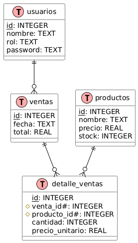
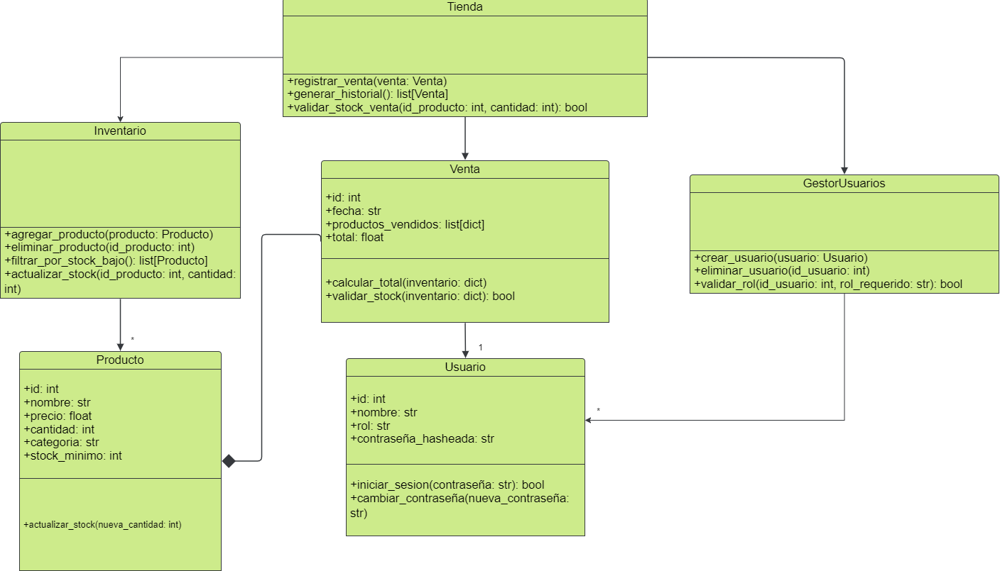

# 📦 Gestor de Inventario y Ventas

Sistema integral para la gestión de productos, ventas y usuarios en un entorno retail, con interfaz gráfica (Kivy) y menú por consola.  
Incluye control de inventario, registro de ventas, gestión de usuarios con roles y pruebas automatizadas.

**Ahora con soporte completo para PostgreSQL.**

---

## 🗂️ Estructura del Proyecto

- **src/modelos/**: Modelos de dominio (Usuario, Producto, Venta)
- **src/database/**: Acceso y gestión de base de datos (PostgreSQL, ORM propio)
- **src/modulos/**: Lógica de negocio (GestorUsuarios, Inventario, Venta)
- **gui/**: Interfaz gráfica de usuario (pantallas Kivy, layouts .kv)
- **cli/**: Menú por consola
- **tests/**: Casos de prueba automatizados (pytest)
- **modelo_relacional.puml**: Diagrama entidad-relación
- **database.sql**: Script DDL para crear las tablas

---

## ⚙️ Instalación y Ejecución

### Requisitos Previos

1. PostgreSQL 12 o superior
2. Python 3.8 o superior
3. pip (gestor de paquetes de Python)

### Instalación

1. Clonar el repositorio:
```bash
git clone <url-del-repositorio>
cd GestorInventario
```

2. Instalar dependencias:
```bash
pip install -r requirements.txt
```

### Configuración de la Base de Datos

1. Instalar PostgreSQL si no está instalado
2. Crear la base de datos y cargar el script DDL:
```bash
psql -U postgres
CREATE DATABASE gestor_inventario;
\q
psql -U postgres -d gestor_inventario -f tienda_ddl_inserts.txt
```

3. Crear archivo `.env` en la raíz del proyecto:
```env
DB_HOST=localhost
DB_PORT=5432
DB_NAME=gestor_inventario
DB_USER=postgres
DB_PASSWORD=tu_contraseña
```

### Ejecutar la Aplicación

#### Interfaz Gráfica (Kivy)
```bash
python gui_main.py
```

#### Interfaz de Consola
```bash
python cli_main.py
```

---

## 🧪 Pruebas Automatizadas

- **Total:** 54 pruebas automatizadas con pytest
- **Cobertura:** >80%
- **Ejecución:**
```bash
pytest tests/
```
- **Lógica de stock:** Ahora `actualizar_stock` reemplaza el valor de stock, no lo suma.
- Todos los tests están actualizados y pasan correctamente.

### **Módulo de Inventario** (24 pruebas)

| ID  | Descripción                          | Entrada / Caso                             | Salida Esperada / Estado                 | Tipo        | Estado |
|-----|--------------------------------------|--------------------------------------------|------------------------------------------|-------------|--------|
| 1   | Agregar producto                     | Producto válido                            | Producto agregado                        | Normal      | ✅     |
| 2   | Eliminar producto existente          | ID existente                               | Producto eliminado                       | Normal      | ✅     |
| 3   | Actualizar stock válido              | Stock positivo                             | Stock actualizado                        | Normal      | ✅     |
| 4   | Filtrar stock bajo                   | Stock < 10                                 | Lista de productos                       | Normal      | ✅     |
| 5   | Eliminar producto                    | ID existente                               | Producto eliminado                       | Normal      | ✅     |
| 6   | Actualizar stock producto            | Stock nuevo                                | Stock actualizado                        | Normal      | ✅     |
| 7   | Producto duplicado                   | ID repetido                                | Error ProductoDuplicado                  | Error       | ✅     |
| 8   | Eliminar producto inexistente        | ID no existente                            | Error ProductoNoEncontrado               | Error       | ✅     |
| 9   | Stock negativo                       | Stock < 0                                  | Error StockInvalido                      | Error       | ✅     |
| 10  | Filtrar stock sin productos          | Lista vacía                                | Lista vacía                              | Normal      | ✅     |
| 11  | Nombre vacío                         | Nombre = ""                                | Error NombreInvalido                     | Error       | ✅     |
| 12  | Actualizar stock inexistente         | ID no existente                            | Error ProductoNoEncontrado               | Error       | ✅     |
| 13  | Nombre con caracteres especiales     | Nombre con símbolos (@#)                   | Producto creado correctamente            | Normal      | ✅     |
| 14  | Categoría vacía                      | Categoría = ""                             | Error CategoriaInvalida                  | Error       | ✅     |
| 15  | Precio negativo                      | Precio < 0                                 | Error PrecioInvalido                     | Error       | ✅     |
| 16  | Stock negativo                       | Stock < 0                                  | Error StockInvalido                      | Error       | ✅     |
| 17  | Agregar producto                     | Producto válido                            | Producto agregado                        | Normal      | ✅     |
| 18  | Eliminar producto                    | ID existente                               | Producto eliminado                       | Normal      | ✅     |
| 19  | Actualizar producto                  | Datos válidos                              | Producto actualizado                     | Normal      | ✅     |
| 20  | Obtener producto inexistente         | ID no existente                            | None                                     | Normal      | ✅     |
| 21  | Actualizar producto inexistente      | ID no existente                            | Error ProductoNoEncontrado               | Error       | ✅     |
| 22  | Actualizar stock negativo            | Stock < 0                                  | Error StockInvalido                      | Error       | ✅     |
| 23  | Obtener todos productos              | -                                          | Lista completa                           | Normal      | ✅     |
| 24  | Producto stock negativo              | Stock < 0                                  | Error StockInvalido                      | Error       | ✅     |

### **Módulo de Usuarios** (11 pruebas)

| ID  | Descripción                          | Entrada / Caso                             | Salida Esperada / Estado                 | Tipo        | Estado |
|-----|--------------------------------------|--------------------------------------------|------------------------------------------|-------------|--------|
| 25  | Crear usuario                        | Usuario válido                             | Usuario creado                           | Normal      | ✅     |
| 26  | Iniciar sesión                       | Credenciales válidas                       | Login exitoso                            | Normal      | ✅     |
| 27  | Cambiar contraseña                   | Contraseña válida                          | Contraseña actualizada                   | Normal      | ✅     |
| 28  | Contraseña inválida                  | Contraseña = ""                            | Error ContraseñaInvalida                 | Error       | ✅     |
| 29  | Credenciales inválidas               | Contraseña incorrecta                      | Error CredencialesInvalidas              | Error       | ✅     |
| 30  | Validar expiración                   | Fecha válida                               | True                                     | Normal      | ✅     |
| 31  | To dict from dict                    | Datos válidos                              | Diccionario correcto                     | Normal      | ✅     |
| 32  | Validar contraseña estática          | Contraseña válida                          | True                                     | Normal      | ✅     |
| 33  | Nombre usuario inválido              | Nombre = ""                                | Error NombreUsuarioInvalido              | Error       | ✅     |
| 34  | Nombre usuario corto                 | Nombre < 3 caracteres                      | Error NombreUsuarioInvalido              | Error       | ✅     |
| 35  | Rol no válido                        | Rol = "inválido"                           | Error RolInvalido                        | Error       | ✅     |
| 36  | Contraseña vacía                     | Contraseña = ""                            | Error ContraseñaInvalida                 | Error       | ✅     |
| 37  | Contraseña corta                     | Contraseña < 6 caracteres                  | Error ContraseñaInvalida                 | Error       | ✅     |

### **Módulo de Ventas** (18 pruebas)

| ID  | Descripción                          | Entrada / Caso                             | Salida Esperada / Estado                 | Tipo        | Estado |
|-----|--------------------------------------|--------------------------------------------|------------------------------------------|-------------|--------|
| 38  | Registrar venta 1                    | Venta válida                               | Venta registrada                         | Normal      | ✅     |
| 39  | Registrar venta 2                    | Venta válida                               | Venta registrada                         | Normal      | ✅     |
| 40  | Registrar venta 3                    | Venta válida                               | Venta registrada                         | Normal      | ✅     |
| 41  | Calcular total                       | Precio y cantidad                          | Total correcto                           | Normal      | ✅     |
| 42  | Validar stock ventas                 | Stock suficiente                           | True                                     | Normal      | ✅     |
| 43  | Generar historial                    | Ventas registradas                         | Historial completo                       | Normal      | ✅     |
| 44  | Producto precio negativo             | Precio < 0                                 | Error PrecioInvalido                     | Error       | ✅     |
| 45  | Producto stock negativo              | Stock < 0                                  | Error StockInvalido                      | Error       | ✅     |
| 46  | Producto duplicado                   | Producto repetido                          | Error ProductoDuplicado                  | Error       | ✅     |
| 47  | Stock insuficiente                   | Stock < cantidad                           | Error StockInsuficiente                  | Error       | ✅     |
| 48  | Venta cantidad negativa              | Cantidad < 0                               | Error CantidadInvalida                   | Error       | ✅     |
| 49  | Fecha inválida                       | Fecha malformada                           | Error FechaInvalida                      | Error       | ✅     |
| 50  | Venta producto fantasma              | Producto no existe                         | Error ProductoNoEncontrado               | Error       | ✅     |
| 51  | Descuento excesivo                   | Descuento > 100%                           | Error DescuentoInvalido                  | Error       | ✅     |
| 52  | Venta sin productos                  | Lista vacía                                | Error VentaInvalida                      | Error       | ✅     |
| 53  | Registrar venta stock insuficiente   | Stock < cantidad                           | Error StockInsuficiente                  | Error       | ✅     |
| 54  | Venta sin empleado                   | id_empleado = None                         | Error VentaSinEmpleado                   | Error       | ✅     |

---

## 🖥️ Funcionalidades Principales

- **Gestión de Inventario:** Alta, baja, modificación y consulta de productos.
- **Gestión de Ventas:** Registro de ventas, validación de stock, historial.
- **Gestión de Usuarios:** Alta, baja, listado y autenticación con roles (admin/empleado).
- **Interfaz Gráfica:** Navegación intuitiva, validación de roles, popups de error/éxito.
- **Menú por Consola:** Acceso a todas las funcionalidades desde CLI.
- **Pruebas Automatizadas:** 54 casos de prueba cubriendo todos los módulos.
- **Modelo Vista Controlador (MVC):** El proyecto está estructurado siguiendo el patrón MVC, separando claramente modelos, vistas y controladores para facilitar el mantenimiento y la escalabilidad.

---

## 🗄️ Integración de Base de Datos

El sistema utiliza **PostgreSQL** como motor de base de datos, gestionado mediante un ORM propio.

- **Script DDL:** Las tablas y relaciones están definidas en el script [`database.sql`](database.sql) (o `tienda_ddl_inserts.txt` si así se llama en tu proyecto; asegúrate de que el nombre sea consistente en todo el README).
- **Modelo Relacional:** El modelo relacional está alineado con la implementación y el diagrama ER.

> **Nota:** El diagrama entidad-relación y el script DDL están sincronizados, garantizando que la estructura de la base de datos concuerda con el modelo lógico del sistema.

---

## ▶️ Ejecución de Pruebas

```bash
# 1. Activar el entorno virtual
.venv\Scripts\activate

# 2. Ejecutar todas las pruebas
pytest tests/

# 3. Ejecutar pruebas específicas
pytest tests/test_usuarios.py -k "test_usuario_duplicado"

# 4. Generar reporte HTML de cobertura
pytest --cov=src --cov-report=html
```

---

## 🚩 Estado del Proyecto

- Todas las funcionalidades implementadas y probadas.
- Interfaz gráfica y menú por consola completamente funcionales.
- Estructura modular siguiendo el patrón Modelo-Vista-Controlador (MVC).
- Sin errores activos conocidos.

---

## 🗃️ Modelo Relacional

El modelo relacional está alineado con el script DDL (`database.sql` o `tienda_ddl_inserts.txt`) y representado en notación Barker (PlantUML):



> El archivo fuente editable está en `modelo_relacional.puml`.

---

## 🗺️ Diagrama Entidad-Relación

El modelo relacional se representa en notación Barker (PlantUML) y está sincronizado con el script DDL, asegurando la correspondencia entre el modelo lógico y la implementación física de la base de datos.

---

## 📊 Diagramas del Sistema

- **Diagrama de Clases:**


- **Diagrama DDL:**


  
---
