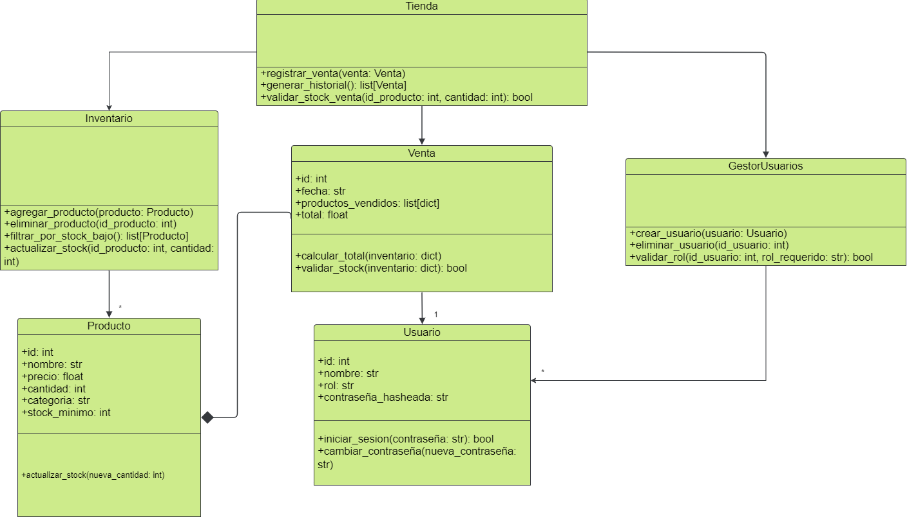
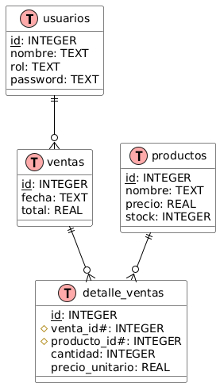

# 📦 Gestor de Inventario y Ventas

Sistema integral para la gestión de productos, ventas y usuarios en un entorno retail, con interfaz gráfica (Kivy) y menú por consola.  
Incluye control de inventario, registro de ventas, gestión de usuarios con roles y pruebas automatizadas.

---

## 🗂️ Estructura del Proyecto

- **src/modelos/**: Modelos de dominio (Usuario, Producto, Venta)
- **src/database/**: Acceso y gestión de base de datos (ORM, SQLite)
- **src/gestores/**: Lógica de negocio (GestorUsuarios, Inventario, Venta)
- **gui/**: Interfaz gráfica de usuario (pantallas Kivy, layouts .kv)
- **cli/**: Menú por consola
- **tests/**: Casos de prueba automatizados (pytest)
- **modelo_relacional.puml**: Diagrama entidad-relación (notación Barker/PlantUML)
- **database.sql**: Script DDL para crear las tablas

---

## ⚙️ Instalación y Ejecución

```bash
# 1. Crear entorno virtual
python -m venv venv
.\venv\Scripts\Activate

# 2. Instalar dependencias
pip install -r requirements.txt

# 3. Variables de entorno (Windows)
$env:PYTHONPATH = "$(Get-Location)"

# 4. Ejecutar interfaz gráfica
python gui_main.py

# 5. Ejecutar menú por consola
python cli/main.py
```

---

## 🖥️ Funcionalidades Principales

- **Gestión de Inventario**: Alta, baja, modificación y consulta de productos.
- **Gestión de Ventas**: Registro de ventas, validación de stock, historial.
- **Gestión de Usuarios**: Alta, baja, listado y autenticación con roles (admin/empleado).
- **Interfaz Gráfica**: Navegación intuitiva, validación de roles, popups de error/éxito.
- **Menú por Consola**: Acceso a todas las funcionalidades desde CLI.
- **Pruebas Automatizadas**: 54 casos de prueba cubriendo todos los módulos.

---

## 🧪 Casos de Prueba

### **Módulo de Inventario** (18 pruebas)

| ID  | Descripción                          | Entrada / Caso                             | Salida Esperada / Estado                 | Tipo        | Estado |
|-----|--------------------------------------|--------------------------------------------|------------------------------------------|-------------|--------|
| 1   | Agregar producto                     | Producto válido                            | Producto agregado                        | Normal      | ✅     |
| 2   | Eliminar producto existente          | ID existente                               | Producto eliminado                       | Normal      | ✅     |
| 3   | Actualizar stock válido              | Stock positivo                             | Stock actualizado                        | Normal      | ✅     |
| 4   | Consultar producto                   | ID existente                               | Producto encontrado                      | Normal      | ✅     |
| 5   | Listar productos                     | -                                          | Lista completa                           | Normal      | ✅     |
| 6   | Actualizar precio                    | Precio válido                              | Precio actualizado                       | Normal      | ✅     |
| 7   | Producto duplicado                   | ID repetido                                | Error ProductoDuplicado                  | Error       | ✅     |
| 8   | Eliminar producto inexistente        | ID no existente                            | Error ProductoNoEncontrado               | Error       | ✅     |
| 9   | Stock negativo                       | Stock < 0                                  | Error ProductoInvalido                   | Error       | ✅     |
| 10  | Precio negativo                      | Precio < 0                                 | Error ProductoInvalido                   | Error       | ✅     |
| 11  | Nombre vacío                         | Nombre = ""                                | Error ProductoInvalido                   | Error       | ✅     |
| 12  | Stock máximo excedido                | Stock > 1000                               | Error StockExcedido                      | Extremo     | ✅     |
| 13  | Nombre largo                         | Nombre > 100 caracteres                    | Error NombreProductoInvalido             | Extremo     | ✅     |
| 14  | Producto con caracteres especiales   | Nombre con símbolos                        | Producto agregado                        | Extremo     | ✅     |
| 15  | Consultar producto inexistente       | ID no existente                            | Error ProductoNoEncontrado               | Error       | ✅     |
| 16  | Actualizar stock a cero              | Stock = 0                                  | Stock actualizado                        | Normal      | ✅     |
| 17  | Eliminar todos los productos         | -                                          | Inventario vacío                         | Normal      | ✅     |
| 18  | Precio negativo en venta             | Venta con precio negativo                  | Error VentaInvalida                      | Extremo     | ✅     |

---

### **Módulo de Usuarios** (16 pruebas)

| ID  | Descripción                          | Entrada / Caso                             | Salida Esperada / Estado                 | Tipo        | Estado |
|-----|--------------------------------------|--------------------------------------------|------------------------------------------|-------------|--------|
| 19  | Crear usuario                        | Usuario válido                             | Usuario creado                           | Normal      | ✅     |
| 20  | Validar rol                          | ID y rol válidos                           | True                                     | Normal      | ✅     |
| 21  | Eliminar usuario                     | ID existente                               | Usuario eliminado                        | Normal      | ✅     |
| 22  | Iniciar sesión exitoso               | Credenciales válidas                       | Login exitoso                            | Normal      | ✅     |
| 23  | Cambiar contraseña                   | Contraseña válida                          | Contraseña actualizada                   | Normal      | ✅     |
| 24  | Iniciar sesión fallido               | Contraseña incorrecta                      | Error CredencialesInvalidas              | Error       | ✅     |
| 25  | Usuario duplicado                    | ID repetido                                | Error UsuarioDuplicado                   | Error       | ✅     |
| 26  | Validar rol inexistente              | ID no existente                            | Error UsuarioNoEncontrado                | Error       | ✅     |
| 27  | Eliminar usuario inexistente         | ID no existente                            | Error UsuarioNoEncontrado                | Error       | ✅     |
| 28  | Contraseña vacía                     | Contraseña = ""                            | Error ContraseñaInvalida                 | Error       | ✅     |
| 29  | Credenciales inválidas               | Contraseña incorrecta                      | Error CredencialesInvalidas              | Error       | ✅     |
| 30  | Cambio a contraseña inválida         | Contraseña = ""                            | Error ContraseñaInvalida                 | Error       | ✅     |
| 31  | Rol con emojis                       | Rol = "admin🔥"                            | Error RolInvalido                        | Extremo     | ✅     |
| 32  | Nombre de 100 caracteres             | Nombre largo                               | Error NombreUsuarioInvalido              | Extremo     | ✅     |
| 33  | Contraseña expirada                  | Fecha expirada                             | Error ContraseñaExpirada                 | Extremo     | ✅     |
| 34  | Rol inexistente                      | Rol = "superheroe"                         | Error RolInvalido                        | Extremo     | ✅     |
| 35  | Nombre usuario vacío                 | Nombre = ""                                | Error NombreUsuarioInvalido              | Extremo     | ✅     |
| 36  | Validar rol usuario eliminado        | Usuario eliminado                          | Error UsuarioNoEncontrado                | Extremo     | ✅     |

---

### **Módulo de Ventas** (20 pruebas)

| ID  | Descripción                          | Entrada / Caso                             | Salida Esperada / Estado                 | Tipo        | Estado |
|-----|--------------------------------------|--------------------------------------------|------------------------------------------|-------------|--------|
| 37  | Registrar venta simple               | Venta con 2 productos                      | Venta registrada                         | Normal      | ✅     |
| 38  | Validar stock en venta               | Stock suficiente                           | True                                     | Normal      | ✅     |
| 39  | Registrar múltiples ventas           | 3 ventas                                   | 3 ventas registradas                     | Normal      | ✅     |
| 40  | Calcular total                       | Precio y cantidad                          | Total correcto                           | Normal      | ✅     |
| 41  | Validar stock post-venta             | Venta realizada                            | Stock reducido                           | Normal      | ✅     |
| 42  | Generar historial                    | Ventas registradas                         | Historial completo                       | Normal      | ✅     |
| 43  | Precio negativo                      | Precio < 0                                 | Error ProductoInvalido                   | Error       | ✅     |
| 44  | Stock negativo                       | Stock < 0                                  | Error ProductoInvalido                   | Error       | ✅     |
| 45  | Producto duplicado                   | Producto repetido en venta                 | Error ProductoDuplicado                  | Error       | ✅     |
| 46  | Stock insuficiente                   | Stock < cantidad solicitada                | Error StockInsuficiente                  | Error       | ✅     |
| 47  | Cantidad negativa en venta           | Cantidad < 0                               | Error VentaInvalida                      | Error       | ✅     |
| 48  | Fecha inválida                       | Fecha malformada                           | Error FechaInvalida                      | Error       | ✅     |
| 49  | Venta producto no registrado         | Producto no existe                         | Error VentaProductoNoRegistrado          | Extremo     | ✅     |
| 50  | Descuento >100%                      | Descuento = 150%                           | Error DescuentoInvalido                  | Extremo     | ✅     |
| 51  | Venta sin productos                  | Lista vacía                                | Error VentaInvalida                      | Extremo     | ✅     |
| 52  | Total negativo                       | Total < 0                                  | Error TotalInvalido                      | Extremo     | ✅     |
| 53  | Venta sin empleado                   | id_empleado = None                         | Error VentaSinEmpleado                   | Extremo     | ✅     |
| 54  | Categoría inválida                   | Categoría no registrada                    | Error CategoriaInvalida                  | Extremo     | ✅     |

---

## 🗃️ Modelo Relacional

El modelo relacional está alineado con el script DDL (`database.sql`) y representado en notación Barker (PlantUML):


> El archivo fuente editable está en `modelo_relacional.puml`.

---

## 🗄️ Integración de Base de Datos

El sistema utiliza **SQLite** como motor de base de datos, gestionado mediante un ORM propio.
Las tablas y relaciones están definidas en el script [`database.sql`](database.sql), y el modelo relacional está alineado con la implementación.

- **Creación de tablas:**
  El script DDL (`database.sql`) crea todas las tablas necesarias (`usuarios`, `productos`, `ventas`, `detalle_ventas`) y define las claves primarias y foráneas.

- **Consultas y operaciones:**
  Todas las operaciones CRUD y consultas complejas se realizan a través de clases ORM en `src/database/`.

---

## 🗺️ Diagrama Entidad-Relación

El modelo relacional se representa en notación Barker (PlantUML):


- El archivo fuente editable está en [`modelo_relacional.puml`](modelo_relacional.puml).

---

## ▶️ Ejecución de Pruebas

```bash
# 1. Activar el entorno virtual
# En Windows:
.venv\Scripts\activate

# 2. Ejecutar todas las pruebas


pytest tests/

# 3. Ejecutar pruebas específicas
pytest tests/test_usuarios.py -k "test_usuario_duplicado"

# 4. Generar reporte HTML de cobertura
pytest --cov=src --cov-report=html
```


---

## 🚩 Estado del Proyecto

- Todas las funcionalidades implementadas y probadas.
- Interfaz gráfica y menú por consola completamente funcionales.
- Estructura modular siguiendo el patrón Modelo-Vista-Controlador (MVC).
- Sin errores activos conocidos.

## 📊 Diagramas del Sistema

- **Diagrama de Clases:**


- **Diagrama DDL:**

  
---
